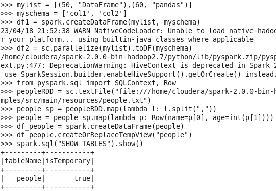
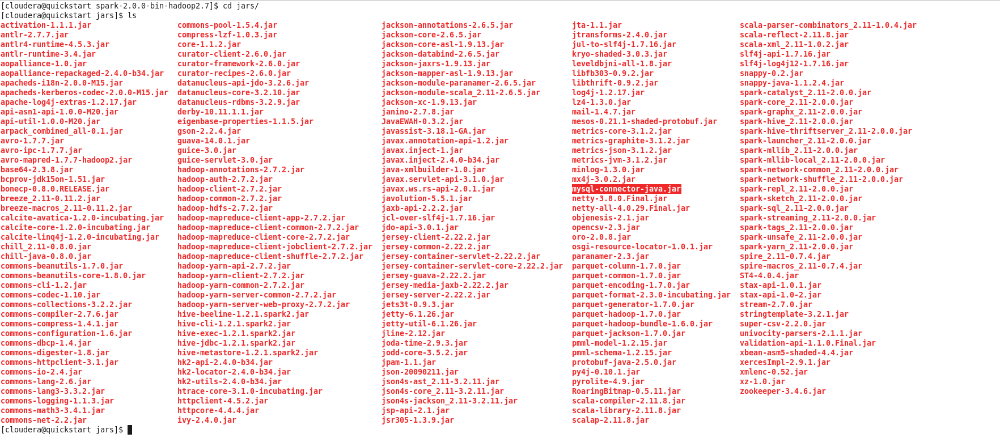
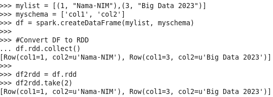
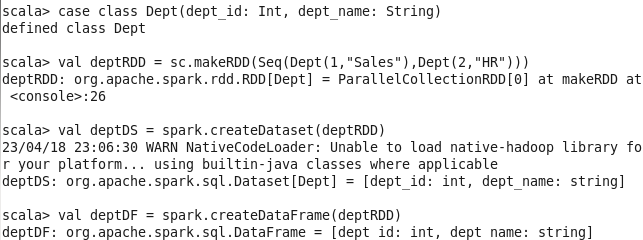
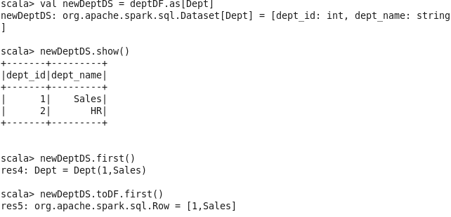
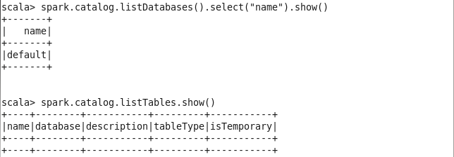
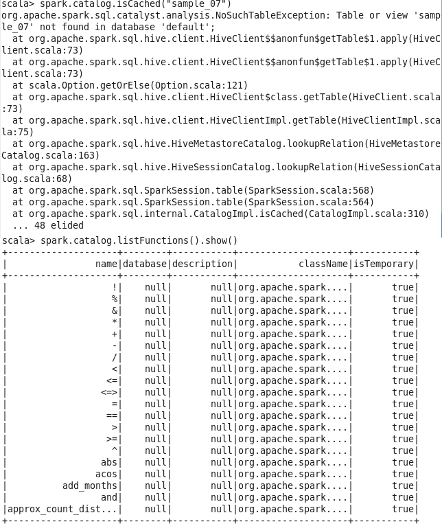
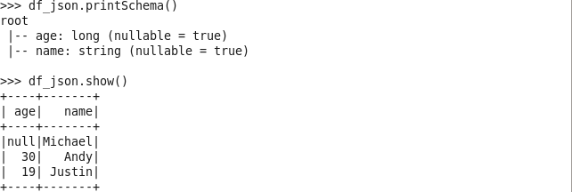
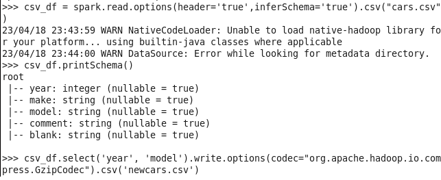

# spark-sql-big-data
NAMA : Jud Amal Mukhtar 

KELAS : TI-3C

NIM : 2041720168
##

PRAKTIKUM
##
1. Analitik dengan DataFrames

    
    
    
    

2. Membuat DataFrame dari Database Eksternal

    
    

3. Mengonversi DataFrames ke RDDs

    

4. Membuat Datasets

    
    

5. Mengonversi DataFrame ke Datasets dan sebaliknya

    

6. Mengakses Metadata menggunakan Catalog

    
    

7. Bekerja dengan berkas teks

    
    

8. Bekerja dengan JSON

    
    

9. Bekerja dengan CSV

    
##

PERTANYAAN
##

Kode 1 : myList, myschema 

Digunakan untuk membuat list dan schema pada awal untuk membuat Dataframe
##

Kode 2 : spark.createDataFrame

Digunakan untuk membuat Dataframe pada RDD dan list
##

Kode 3 : parallelize, toDF

Digunakan untuk membuat RDD dari kumpulan list
##

Kode 4 :
- Hadoop : sebuah framework open-source untuk menyimpan dan memproses data besar secara terdistribusi.
- fs : menyediakan akses ke berbagai sistem file termasuk Hadoop Distributed File System (HDFS) dan sistem file lokal.
- put : sebuah operasi untuk mengunggah file atau objek dari mesin lokal atau virtual ke sistem penyimpanan objek pada PySpark.
##

Kode 5 : 
- pyspark.sql : package pada Apache Spark yang digunakan untuk mengakses data terstruktur menggunakan SQL dan DataFrame API pada lingkungan pemrograman Python.
- SQLContext : digunakan untuk mengakses data terstruktur menggunakan SQL pada lingkungan pemrograman Scala, Java, dan Python.
- createOrReplaceTempView : Membuat atau mengganti tampilan sementara lokal dengan DataFrame ini.
- show : Mencetak n baris pertama ke konsol.
##

Kode 6 : 
- textFile : Membaca file teks dari HDFS.
- map : Mengembalikan RDD baru dengan menerapkan fungsi ke setiap elemen RDD ini.
- lambda : Merupakan fungsi sederhana yang dapat ditulis sebagai ekspresi
- strip : digunakan untuk membersihkan atau menghilangkan karakter whitespace pada data yang dibaca dari suatu file.
- structField : representasi dari sebuah field di StructType.
- stringType : digunakan untuk merepresentasikan kolom dengan tipe data string atau teks
##

Kode 7 : 
- spark.read.format : salah satu metode yang digunakan di Apache Spark untuk membaca data dari berbagai sumber data seperti file CSV, JSON, Parquet, Avro.
- jdbc : modul yang tersedia di Apache Spark yang digunakan untuk membaca dan menulis data dari database menggunakan JDBC (Java Database Connectivity)
- options : menentukan opsi konfigurasi saat membaca atau menulis data dari atau ke sumber eksternal.
- load : memuat data ke dalam DataFrame dengan format tertentu, seperti CSV, JSON, parquet, atau ORC
##

Kode 8 : 
- show digunakan untuk menampilkan data dari DataFrame secara tabular.
##

Kode 9 : 
- collect : digunakan untuk mengambil seluruh data dari DataFrame dan dikumpulkan dalam bentuk Python list.
- rdd : digunakan untuk kumpulan data yang terdistribusi di seluruh node dalam sebuah cluster, yang dapat diproses secara terpisah dan paralel.
- take : mengambil sejumlah baris dari sebuah RDD atau DataFrame dan mengembalikan hasilnya ke driver node dalam bentuk Python list
##

Kode 10 : 
- makeRDD : digunakan untuk membuat RDD baru dari data yang sudah ada di dalam memori, seperti list, tuple, atau array
- Seq : tipe data di Scala yang merepresentasikan sebuah urutan dari elemen-elemen yang dapat diakses secara berurutan.
- createDataset : digunakan untuk membuat sebuah Dataset.
##

Kode 11 : filter

Digunakan untuk melakukan filtering pada sebuah Dataset atau DataFrame untuk kriteria tertentu
##

Kode 12 : 
- as : digunakan untuk memberikan alias pada sebuah kolom dalam sebuah DataFrame atau Dataset
- toDF : digunakan untuk mengubah sebuah RDD (Resilient Distributed Dataset) menjadi sebuah DataFrame
- first : digunakan untuk mengembalikan elemen pertama dari RDD.
##

Kode 13 : 
- listDatabases : Mengembalikan daftar database yang tersedia di semua sesi
- listTables : Mengembalikan daftar tabel/tampilan dalam database yang ditentukan.
- listFunctions : Mengembalikan daftar fungsi yang terdaftar di database yang ditentukan.
- isCached : Mengembalikan nilai true jika tabel saat ini di-cache dalam memori.
- select : digunakan untuk memproyeksikan sekumpulan ekspresi dan mengembalikan DataFrame baru.
##

Kode 14 : 
- read : digunakan untuk menyesuaikan cara data dibaca dari source data.
- text : digunakan untuk membaca file teks ke dalam DataFrame.
##

Kode 15 : 
- load : digunakan untuk memuat data dari sumber data dan mengembalikannya dalam bentuk DataFrame.
- json : digunakan untuk membaca file JSON ke dalam Spark DataFrame.
- format : load sebuah file / memformat hasil file dengan tipe data tertentu
- printSchema : Mencetak skema dataframe dalam format tree.
##

Kode 16 : 
- write : digunakan untuk menyimpan konten DataFrame yang bukan streaming ke penyimpanan eksternal.
- save : digunakan untuk menyimpan konten DataFrame ke sumber data
##

Kode 17 : parquet

digunakan untuk menyimpan data secara kolomar dalam bentuk kompresi, yang terdiri dari beberapa baris dan kolom. 
##

Kode 18 : 
- options : digunakan untuk menyesuaikan atau memberikan opsi pada bagaimana data akan dibaca dari sumbernya.
- inferSchema : opsi konfigurasi saat membaca data dari format file seperti CSV, TSV, dan lain-lain.
- csv : digunakan untuk memuat file CSV dan mengembalikan hasilnya sebagai DataFrame.
- header : opsi jika file csv memiliki header, maka baris pertama akan digunakan sebagai nama kolom.
- codec : opsi ini digunakan untuk menentukan codec kompresi yang akan digunakan saat pada output.
